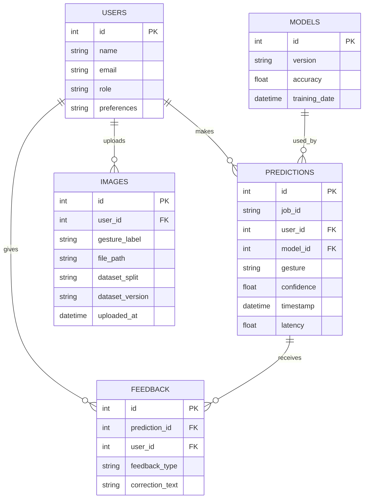

<!-- if you want to see this diagram install the mermaid extension on vs code and then press shift crtl v -->

```mermaid
erDiagram
    USERS {
        int id PK
        string name
        string email
        string role
        string preferences
    }

    MODELS {
        int id PK
        string version
        float accuracy
        datetime training_date
    }

    PREDICTIONS {
        int id PK
        string job_id
        int user_id FK
        int model_id FK
        string gesture
        float confidence
        datetime timestamp
        float latency
    }

    FEEDBACK {
        int id PK
        int prediction_id FK
        int user_id FK
        string feedback_type
        string correction_text
    }

    IMAGES {
        int id PK
        int user_id FK
        string gesture_label
        string file_path
        string dataset_split
        string dataset_version
        datetime uploaded_at
    }

    %% Relationships
    USERS ||--o{ PREDICTIONS : "makes"
    USERS ||--o{ FEEDBACK : "gives"
    PREDICTIONS ||--o{ FEEDBACK : "receives"
    MODELS ||--o{ PREDICTIONS : "used_by"
    USERS ||--o{ IMAGES : "uploads"
```