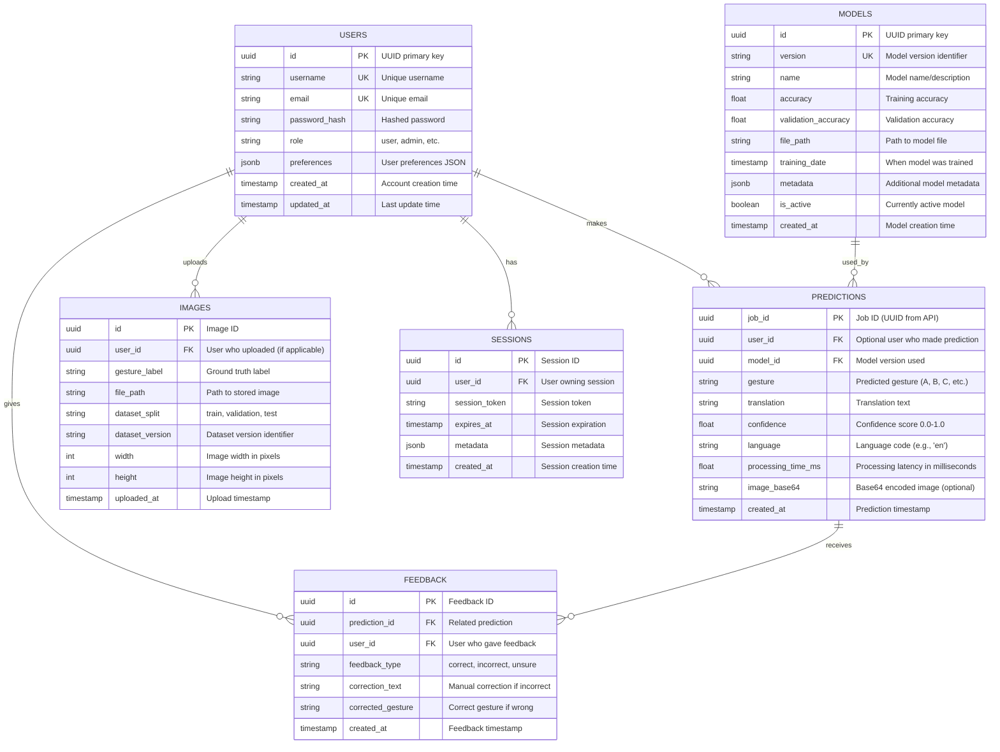

<!-- ASL Translator Database ERD -->
<!-- To view: Install Mermaid extension in VS Code and press Shift+Ctrl+V -->
<!-- Compatible with mermaid-db extension -->

```mermaid
erDiagram
    USERS {
        uuid id PK "UUID primary key"
        string username UK "Unique username"
        string email UK "Unique email"
        string password_hash "Hashed password"
        string role "user, admin, etc."
        jsonb preferences "User preferences JSON"
        timestamp created_at "Account creation time"
        timestamp updated_at "Last update time"
    }

    MODELS {
        uuid id PK "UUID primary key"
        string version UK "Model version identifier"
        string name "Model name/description"
        float accuracy "Training accuracy"
        float validation_accuracy "Validation accuracy"
        string file_path "Path to model file"
        timestamp training_date "When model was trained"
        jsonb metadata "Additional model metadata"
        boolean is_active "Currently active model"
        timestamp created_at "Model creation time"
    }

    PREDICTIONS {
        uuid job_id PK "Job ID (UUID from API)"
        uuid user_id FK "Optional user who made prediction"
        uuid model_id FK "Model version used"
        string gesture "Predicted gesture (A, B, C, etc.)"
        string translation "Translation text"
        float confidence "Confidence score 0.0-1.0"
        string language "Language code (e.g., 'en')"
        float processing_time_ms "Processing latency in milliseconds"
        string image_base64 "Base64 encoded image (optional)"
        timestamp created_at "Prediction timestamp"
    }

    FEEDBACK {
        uuid id PK "Feedback ID"
        uuid prediction_id FK "Related prediction"
        uuid user_id FK "User who gave feedback"
        string feedback_type "correct, incorrect, unsure"
        string correction_text "Manual correction if incorrect"
        string corrected_gesture "Correct gesture if wrong"
        timestamp created_at "Feedback timestamp"
    }

    IMAGES {
        uuid id PK "Image ID"
        uuid user_id FK "User who uploaded (if applicable)"
        string gesture_label "Ground truth label"
        string file_path "Path to stored image"
        string dataset_split "train, validation, test"
        string dataset_version "Dataset version identifier"
        int width "Image width in pixels"
        int height "Image height in pixels"
        timestamp uploaded_at "Upload timestamp"
    }

    SESSIONS {
        uuid id PK "Session ID"
        uuid user_id FK "User owning session"
        string session_token "Session token"
        timestamp expires_at "Session expiration"
        jsonb metadata "Session metadata"
        timestamp created_at "Session creation time"
    }

    %% Relationships
    USERS ||--o{ PREDICTIONS : "makes"
    USERS ||--o{ FEEDBACK : "gives"
    USERS ||--o{ IMAGES : "uploads"
    USERS ||--o{ SESSIONS : "has"
    
    MODELS ||--o{ PREDICTIONS : "used_by"
    
    PREDICTIONS ||--o{ FEEDBACK : "receives"
```